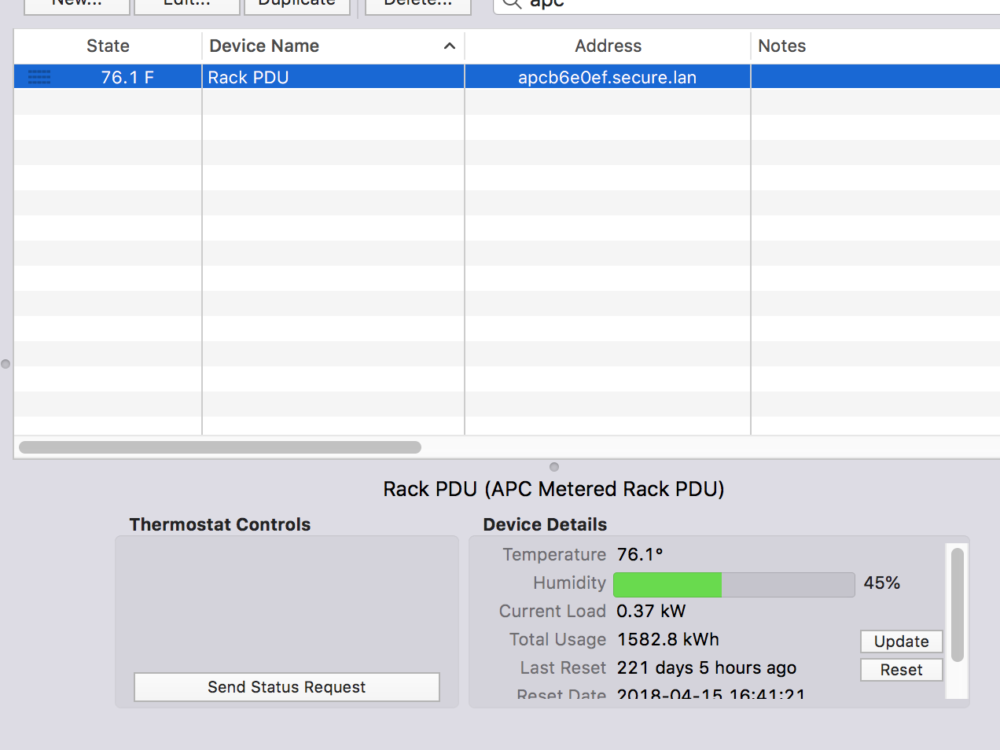

# Indigo Plugin: APC Metered Rack PDU

This device can be connected to an optional temperature and humidity sensor.

With this plugin, you can read the energy usage, temperature and humidity
sensors from an [APC Metered Rack PDU](https://www.amazon.com/APC-Metered-Rack-PDU-AP8858/dp/B00WDCL5SE/).

## Info
[This particular device](https://www.apc.com/shop/us/en/categories/power-distribution/rack-power-distribution/metered-rack-pdu/_/N-wj7jiz)
does not allow control or energy readings of individual outlets.
The energy readings are aggregate and the temperature sensor is optional.
If you'd like support for other devices, hit me up, and lets work on it.

The included image is that of the device I use with this plugin.

This is an image of what the device looks like in Indigo:

The "Thermostat Controls" are a byproduct of adding a temperature or
humidity sensors to a custom device. Not much can be done about it.

## Usage

1. Clone or [download](https://github.com/davidnewhall/indigoplugins-apc-metered-rack-pdu/archive/master.zip) this repo.
2. Double-click the included plugin file.
3. Install and Enable the Plugin.
4. Add a New Device, Select APC Rack PDU then APC Metered Rack PDU.
5. Enter the IP address, username and password for your PDU.
6. If you have the temp sensor, select 1 for Temperature and Humidity Sensor Counts.
7. It should work. If it does not work, check that you can ssh from command line.

## License

- [GPLv2](https://www.gnu.org/licenses/gpl-2.0.txt): See [LICENSE](LICENSE) File
